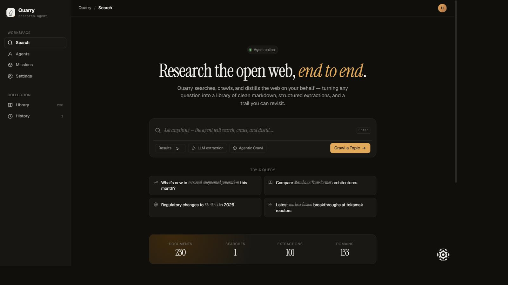
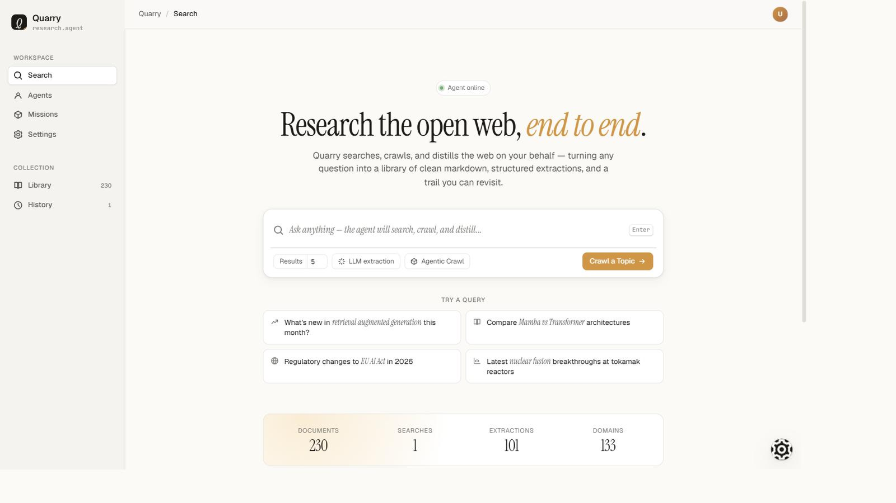
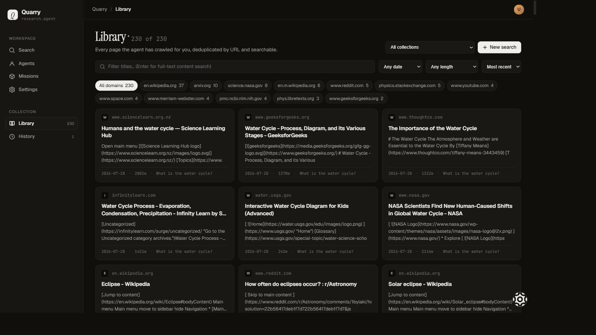
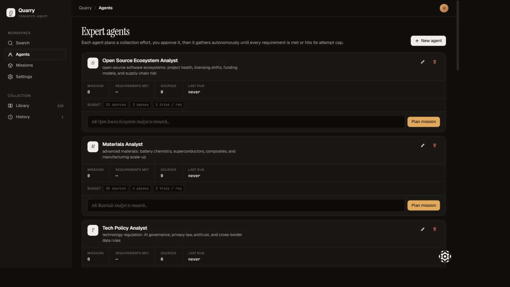
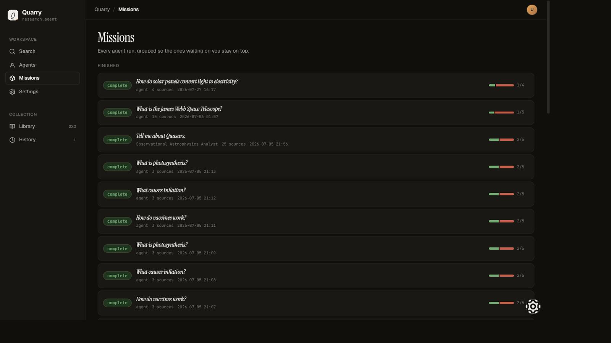

# Quarry

A small Flask app that turns a question into a searchable library of cleaned web pages and structured LLM extractions.



<sub>Light theme. The UI ships both, switchable from the tweaks panel.</sub>



The agent runs three stages end-to-end:

1. **Search**: DuckDuckGo text search via [`ddgs`](https://pypi.org/project/ddgs/).
2. **Crawl**: concurrent headless Chromium fetches via [`crawl4ai`](https://github.com/unclecode/crawl4ai), producing both raw and fit-markdown.
3. **Extract** *(optional)*: per-document LLM extraction via [`litellm`](https://github.com/BerriAI/litellm), so you can use any supported provider (or a fully local model). Output is JSON: summary, key facts, entities, topics, sentiment, or whatever your custom prompt asks for.

Everything is persisted to SQLite so you can re-open documents, re-run extractions, and revisit the search trail later.

## Quick start (Docker)

```bash
cp .env.example .env
# edit .env: pick an LLM_PROVIDER and set LLM_API_KEY (see "Choosing a provider")

docker compose up -d --build
```

Then open [http://localhost:5000](http://localhost:5000).

The first build is slow (~5 min) because `crawl4ai-setup` downloads Chromium. Subsequent rebuilds reuse cached layers.

The `data/` directory is bind-mounted, so `data/research.db` survives container rebuilds.

## Local dev (no Docker)

```bash
python -m venv .venv && . .venv/Scripts/activate   # or .venv/bin/activate on macOS/Linux
pip install -r requirements.txt
crawl4ai-setup            # one-time: installs Chromium for crawl4ai
cp .env.example .env      # then edit
python app.py
```

## Configuration

All settings come from `.env` (see `.env.example`):

| Variable | Purpose | Default |
| --- | --- | --- |
| `LLM_API_KEY` | API key for the hosted provider you chose (not needed for Ollama) | *(empty)* |
| `LLM_PROVIDER` | Reasoning-tier model (planning, gap assessment) | `cohere/command-a-03-2025` |
| `LLM_PROVIDER_FAST` | Fast-tier model (brief synthesis, extraction); empty → reuse reasoning model | *(empty)* |
| `OLLAMA_API_BASE` | Ollama endpoint for `ollama/`-prefixed models | `http://host.docker.internal:11434` |
| `QUARRY_BIND` | Host interface Docker publishes on (`127.0.0.1` = this machine only) | `127.0.0.1` |
| `SEARCH_MAX_RESULTS` | Default result count for the search form | `5` |
| `DB_PATH` | SQLite file path | `data/research.db` |
| `CRAWL_TIMEOUT` | Per-page crawl timeout (ms) | `30000` |
| `FLASK_HOST` / `FLASK_PORT` | Bind address | `0.0.0.0:5000` |
| `FLASK_DEBUG` | Flask debug + auto-reload | `false` |
| `FLASK_SECRET_KEY` | Override Flask session signing key. Empty → generated once into `data/secret_key` | *(empty)* |
| `QUARRY_PASSWORD` | Optional login password. Empty → no login | *(empty)* |
| `QUARRY_BEHIND_PROXY` | Behind a TLS-terminating reverse proxy (ProxyFix + Secure cookie) | `false` |

### Choosing an LLM provider

Quarry calls LLMs through LiteLLM, so **no vendor is required** — pick one, set
`LLM_PROVIDER`, and put that vendor's key in `LLM_API_KEY`:

| Provider | `LLM_PROVIDER` | Get an API key |
| --- | --- | --- |
| Cohere | `cohere/command-a-03-2025` | [dashboard.cohere.com/api-keys](https://dashboard.cohere.com/api-keys) |
| OpenAI | `openai/gpt-4o-mini` | [platform.openai.com/api-keys](https://platform.openai.com/api-keys) |
| Anthropic | `anthropic/claude-sonnet-4-5` | [console.anthropic.com/settings/keys](https://console.anthropic.com/settings/keys) |
| Google | `gemini/gemini-2.0-flash` | [aistudio.google.com/app/apikey](https://aistudio.google.com/app/apikey) |
| Groq | `groq/llama-3.3-70b-versatile` | [console.groq.com/keys](https://console.groq.com/keys) |
| **Ollama (local)** | `ollama_chat/qwen2.5:14b` | **none — runs on your machine** |

**No API key at all?** Install [Ollama](https://ollama.com), run
`ollama pull qwen2.5:14b`, set `LLM_PROVIDER=ollama_chat/qwen2.5:14b`, and leave
`LLM_API_KEY` empty. Everything works locally and free.

If you already use a vendor's standard variable (`OPENAI_API_KEY`,
`ANTHROPIC_API_KEY`, …), leave `LLM_API_KEY` blank and LiteLLM will pick it up.

**Two tiers.** `LLM_PROVIDER` handles planning and gap assessment; the optional
`LLM_PROVIDER_FAST` handles brief synthesis and extraction. Pointing the fast
tier at a local Ollama model keeps the high-volume calls free while a stronger
hosted model does the reasoning. If the fast tier fails (Ollama down), calls
fall back to the reasoning model automatically.

Providers and the key can also be changed at runtime on the **Settings** page
(`/settings`), which links to each vendor's key page. Those choices persist to
`data/settings.json` (never the repo), apply immediately, and take precedence
over `.env`.

## Features

- **End-to-end agent run** with a live progress page showing search results, in-flight crawls, and an agent log stream.
- **Library**: every crawled page, deduplicated by URL, with client-side filtering by domain/age/word-count and full-text search across titles + snippets.
- **History**: every search the agent ran, grouped by day. Each entry has:
  - **Live crawl**: opens the trace (URL stream + agent log) for that run, while the job is still in memory.
  - **View**: opens Library filtered to just the documents from that search (`/documents?search=...`).
  - **Re-run**: re-submits the same query.
- **Persistent sidebar**: "Live crawl" links to the most recent run (pulse dot when active); "Previous live crawls" lists earlier runs from the current process.
- **Per-document deep view**: markdown content, metadata, links, related documents from the same search/domain, and any extractions, plus an inline button to run a new extraction with a custom prompt.



### Agentic collection

Beyond one-shot search, a saved **agent** runs a **mission**: it decomposes the
question into requirements, stops at an editable approval gate, then collects
autonomously, assessing each requirement, re-tasking the gaps, and synthesizing
a cited brief. Completion is concrete rather than vibes: a mission ends when
every requirement is satisfied or provably unmet, bounded by attempt and source
budgets.

An agent is just a name, an area of expertise, and a budget; the persona is
generated from the expertise. Give one a cron expression and a standing question
and it runs unattended, each brief leading with what changed since its own last
run.





## Architecture

```
app.py            Flask routes + context processor; spawns background jobs.
config.py         Pydantic Settings → reads .env.
models.py         Pydantic models: SearchResult, Document, ExtractedData, SearchRecord.
search.py         DuckDuckGo wrapper.
crawler.py        crawl4ai async wrapper; emits per-URL progress to the job store.
extractor.py      LiteLLM call; tries to parse JSON, falls back to {"raw_response": ...}.
jobs.py           In-memory job store + threaded async runner.
                  Tracks recent job IDs for the sidebar.
storage.py        aiosqlite: documents / extractions / searches tables.
templates/        Jinja2: base.html (shell + sidebar) extended by per-page templates.
static/style.css  Hand-rolled CSS, supports light/dark themes + accent swatches.
```

### Job lifecycle

1. `POST /search` calls `create_job(...)` → returns a UUID and starts a daemon thread.
2. The thread runs `_run_job(job_id)` → search → crawl → optional extract → done.
3. The crawl page polls `GET /api/job/<id>` every 500ms, rendering URL rows and log lines incrementally.
4. On completion, the page stops polling and shows a "Jump to results" button (no auto-redirect).
5. The job record (URL stream + log + document IDs) lives in memory until the process restarts.

### Data model

```
documents       crawled pages, keyed by UUID, unique on (url, search_query)
extractions     LLM output per document, with the prompt that produced it
searches        one row per agent run, with job_id back-reference for trace lookup
```

## Security posture

Designed for **single-user local use** behind a firewall. Some specifics:

- **Optional password login.** By default there is no login and Docker publishes on `127.0.0.1` (`QUARRY_BIND`), so the app is reachable only from the host machine. Before widening `QUARRY_BIND`, set `QUARRY_PASSWORD` in `.env` — every page and API then requires sign-in (rate-limited, 30-day session, logout in the sidebar). The value can be a Werkzeug hash instead of plaintext. Even with a password set, prefer Tailscale/VPN over direct internet exposure.
- **Sessions survive restarts.** The signing key is generated once into `data/secret_key` (0600); set `FLASK_SECRET_KEY` to override.
- **Response hardening:** `X-Frame-Options: DENY`, `X-Content-Type-Options: nosniff`, `Referrer-Policy: strict-origin-when-cross-origin` on every response.
- **Behind TLS?** Set `QUARRY_BEHIND_PROXY=true` when a TLS-terminating reverse proxy fronts the app: it enables ProxyFix (correct client IPs for login rate limiting) and the `Secure` cookie flag. LAN exposure over plain HTTP sends the password and session cookie in cleartext — use a TLS proxy or Tailscale.
- **Footgun guard:** binding beyond loopback without a password logs a loud startup warning and shows a red banner in the UI.
- **Bounded job store:** at most 6 crawl/mission jobs run concurrently (each is a thread + headless Chromium); finished live traces are evicted after a keep-window so memory can't grow unbounded.
- **Pinned dependencies:** `constraints.txt` (a `pip freeze` of a verified image) pins the full tree for reproducible builds.
- **`FLASK_DEBUG` defaults to `false`** in `.env.example`. Never set it to `true` on a host reachable from untrusted networks; Werkzeug's debugger console is an RCE primitive.
- **Crawled HTML is treated as untrusted.** Page titles, URLs, and error strings are HTML-escaped before being inserted into the live agent log. Server-side templates use Jinja autoescape throughout.
- **Inputs are bounded:** query ≤ 500 chars, extraction prompt ≤ 5000 chars, `max_results` clamped to 1–20.
- **Container runs as a non-root `app` user** (UID 1000). The bind-mounted `data/` directory must be writable by that UID on the host.
- **Prompt injection is possible**: the LLM extractor sees raw page content. Treat extraction output as suggestion, not ground truth. Don't pipe it into anything that auto-executes.
- **No CSRF tokens.** Acceptable for a localhost-only app where the SameSite=Lax default on session cookies blocks the relevant cross-site POST scenarios. If you front this with a real domain and add auth, add CSRF tokens too.
- **DDG returns external URLs only.** No allowlist on what the crawler will fetch; a crafted query could in theory point the crawler at a private network address. Out of scope today; consider an SSRF guard if you ever expose this.

## Notes & caveats

- **In-memory job store.** URL streams, log entries, and the sidebar's "Previous live crawls" list reset when the Flask process restarts. The DB persists; the live trace does not. The History → Live Crawl button auto-hides for jobs no longer in memory.
- **DuckDuckGo rate limiting.** Heavy use can return zero results temporarily; the agent surfaces this as `no search results`.
- **Extraction context window.** Documents are truncated to ~20k chars before being sent to the LLM (see `extractor.py`).
- **Single-user design.** The job store and "recent crawls" tracker are global module state, which is fine for local use but not safe for multi-user deployments.
- **Production WSGI.** The Docker image runs gunicorn (1 worker × 16 threads). The worker count must stay at 1 because the live crawl/mission trace is held in process memory, so multiple workers would split state. `python app.py` still uses Flask's dev server for local development.

## License

Released under the MIT License. See [LICENSE](LICENSE).
